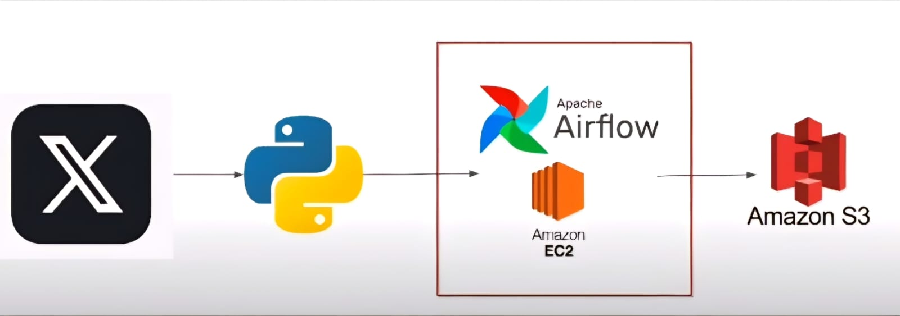

# Twitter/X ETL Project with Airflow and AWS



## Description

This project is an ETL (Extract, Transform, Load) pipeline that extracts tweets from a user's Twitter account, transforms them into a more usable format, and loads them into an Amazon S3 bucket using Airflow on an AWS EC2 instance.

## Project Structure

    
    twitter-etl-project/
    │
    ├── dags/
    │   └── twitter_dag.py
    ├── scripts/
    │   ├── twitter_etl.py
    │   └── config.py
    ├── config.yaml
    ├── requirements.txt
    ├── README.md
    └── .gitignore
    


- `dags/`: Contains the Airflow DAGs.
- `scripts/`: Contains the Python scripts.
- `config.yaml`: Configuration file for credentials and other sensitive parameters.
- `requirements.txt`: List of project dependencies.
- `.gitignore`: Files and folders to be ignored by Git.
- `README.md`: Project description.

## Setup

1. Clone the repository:
    ```bash
    git clone https://github.com/lucianoalessi/twitter-etl-airflow.git
    cd twitter-etl-project
    ```

2. Create and activate a virtual environment:
    ```bash
    python3 -m venv venv
    source venv/bin/activate # On Windows use `venv\Scripts\activate.bat`
    ```

3. Install the dependencies:
    ```bash
    pip install -r requirements.txt
    ```

4. Configure your credentials and other parameters in `config.yaml` using the following template:

    ```yaml
    twitter:
      bearer_token: ""
      access_key: ""  # Twitter API access key
      access_secret: ""  # Twitter API access secret
      consumer_key: ""  # Twitter API consumer key
      consumer_secret: ""  # Twitter API consumer secret

    aws:
      s3_bucket: "your_s3_bucket_name"  # Name of the S3 bucket
      s3_path: "your_s3_path"  # Path in the S3 bucket where data will be stored
    ```

## Execution

To run the ETL pipeline, ensure Airflow is configured and run the `twitter_dag` DAG.


## Setting up and Running Airflow on AWS EC2

1. Launch an EC2 instance:

    - Log in to your AWS console and launch a new EC2 instance.
    - Choose an AMI (e.g., Amazon Linux 2).
    - Configure instance size (t2.micro should be sufficient for testing).
    - Configure networking options and ensure HTTP (port 80) and SSH (port 22) traffic is allowed.

2. Connect to your EC2 instance:

    ```
    ssh -i "your_key.pem" ec2-user@your_ec2_instance_ip
    ```

3. Install Airflow dependencies:

    ```console
    sudo yum update -y
    sudo yum install -y python3
    sudo pip3 install apache-airflow
    ```

4. Initialize Airflow database:

    ```console
    airflow db init
    ```
5. Create an admin user for Airflow:


    ```console
    airflow users create --username admin --firstname Admin --lastname User --role Admin --email admin@example.com
    ```

6. Configure airflow.cfg file:

    - Edit the configuration file to change the executor to LocalExecutor.

        ```console
        nano ~/airflow/airflow.cfg
        ```
    - Change executor = SequentialExecutor to executor = LocalExecutor.

7. Start Airflow web server and scheduler:

    ```console
    airflow webserver --port 8080
    airflow scheduler
    ```

8. Access Airflow web interface:

    - Open your browser and go to http://your_ec2_instance_ip:8080.
    - Log in using the credentials you created earlier.

9. Upload your DAG and scripts to the EC2 instance:

    - Use scp to copy files from your local machine to the EC2 instance.

    ```console
    scp -i "your_key.pem" -r ./twitter-etl-project ec2-user@your_ec2_instance_ip:~/airflow/dags/
    ```
## Setting up AWS S3

1. Create an S3 bucket:

    - Log in to your AWS console.
    - Navigate to S3 and click on "Create bucket".
    - Enter a unique name for your bucket and select a region.
    - Click on "Create bucket".

2. Set permissions for the bucket:

    - Navigate to your newly created bucket.
    - Go to the "Permissions" tab and configure necessary policies to allow access from your EC2 instance.

3. Install AWS CLI on your EC2 instance:

    ```console
    sudo yum install aws-cli -y
    ```
4. Configure AWS CLI with your credentials:

    ```console
    aws configure
    ```
    - Enter your Access Key ID, Secret Access Key, region, and output format.

5. Test access to your S3 bucket:

    ```console
    aws s3 ls s3://your_s3_bucket_name
    ```

## Error Handling

The script handles several types of errors, including authentication errors and general Twitter API errors. Error messages are logged to facilitate debugging.

## Contributions

Contributions are welcome. Please open an issue or create a pull request.

## License

This project is licensed under the [MIT License](LICENSE).